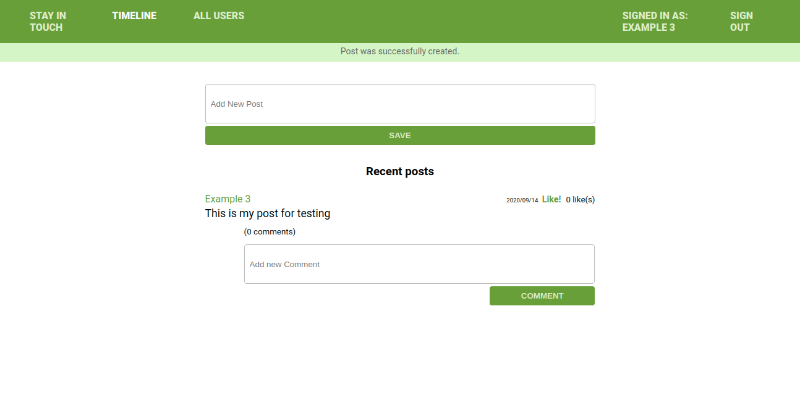

# Stay in touch

> This is the project which simulate social media website, we did it for learning purpose, to get familiar with complex association such as friendship tables just the way facebook like social media work.

## Screenshot


## Built With
- Ruby v2.7.0
- Ruby on Rails v5.2.4

## Live Demo

TBA


## Getting Started

To get a local copy up and running follow these simple example steps.

### Prerequisites

Ruby: 2.7.0
Rails: 5.2.3
Postgres: >=9.5

### Setup

Install gems with:

```
bundle install
```

Setup database with:

```
   rails db:create
   rails db:migrate
```


### Usage

Start server with:

```
    rails server
```

Open `http://localhost:3000/` in your browser.

### Run tests

Run the tests by running the following command
```
    bundle exec rspec --format documentation
```

### Deployment

TBA

## Authors
### 1. MUGIRASE Emmanuel
* Github: [@descholar-ceo](https://github.com/descholar-ceo)
* Twitter: [@descholar3](https://twitter.com/descholar3)
* LinkedIn: [MUGIRASE Emmanuel](https://www.linkedin.com/in/mugirase-emmanuel)

### 2. Witah Ngu Georjane
* Github: [@Georjane](https://github.com/Georjane)
* Twitter: [@WittyJany](https://twitter.com/WittyJany)
* LinkedIn: [Witah Georjane](https://www.linkedin.com/in/witah-georjane)

## Contributing
There are two ways of contributing to this project:

1. If you see something wrong or not working, please open the issue in issue section
2. If you see something to improve or to correct, and you have a solution to that, follow the below steps to contribute:
    1. Fork this repository
    2. Clone it on your local computer by running `git clone https://github.com/your-username/ror-social-scaffold.git` __Replace *your username* with the username you use on github__
    3. Open the cloned repository which appears as a folder on your local computer with your favorite code editor
    4. Create a separate branch off the *master branch*,
    5. Write your codes which fix the issue you found
    6. Commit and push the branch you created
    7. Open a pull request, comparing your new created branch with our original master branch [here](https://github.com/Georjane/ror-social-scaffold)

## Show your support

Give a ⭐️ if you like this project!

## Acknowledgment
* [Microverse](https://www.microvese.org)
* [The Odin Project](https://www.theodinproject.com)
